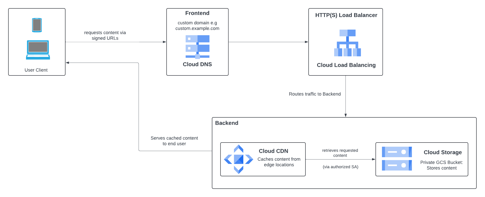
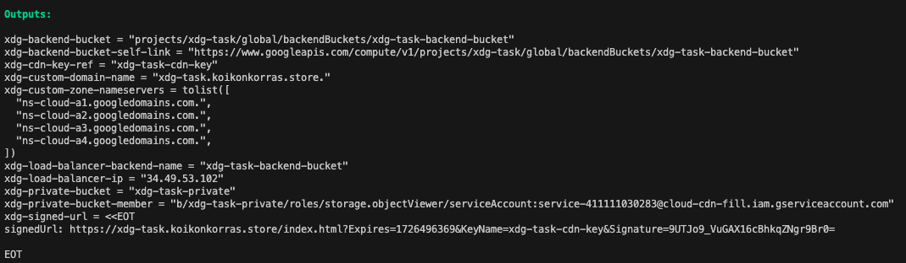
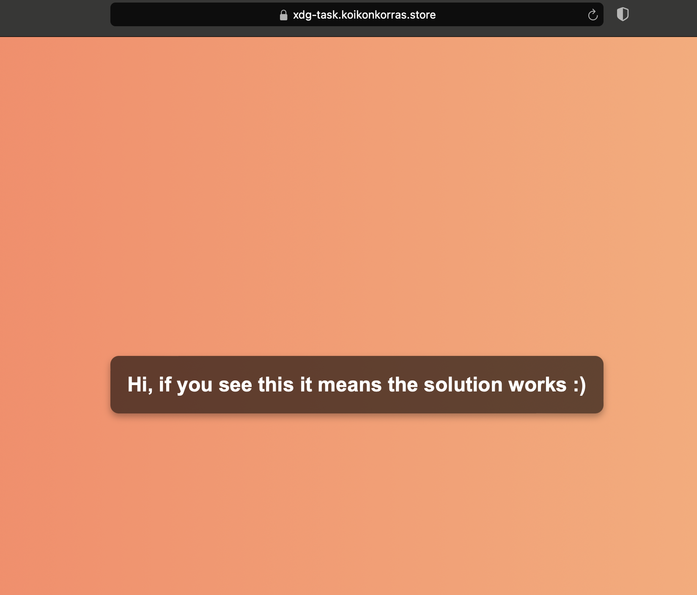

# XDG-Test-Task

## Table of Contents

- [General Overview](#general-overview)
- [Architechture Overview](#architechture-overview)
- [Installation Guide](#installation-guide)
    - [Assumptions](#assumptions)
    - [Prerequisites](#prerequisites)
        - [Tools](#tools)
        - [Helpers](#helpers)
    - [Installation](#installation)
- [Verification](#verification)
    - [Important Things to Note](#important-things-to-note)
    - [Verify](#verify)


## General Overview

This solution is designed to serve static content stored in a private GCP bucket over a custom domain name by using Cloud CDN. It makes use of a combination of different GCP services.
On a high level, it does the following:
- Enables all the necessary Google APIs for the services that will be used
- Creates a private GCP bucket and uploads dummy content to it
- Handles DNS configuration for custom domain and creates A record that's pointed to an acquired external IP address
- Sets up Cloud CDN by configuring a backend bucket with cdn functionality enabled that is tied to the private GCP bucket
- Generates a URL signing key and attaches it to the configured backend bucket (this will be used by Cloud CDN to filter which requests to serve content to)
- Stores the URL signing key in Google secret manager
- Configures HTTPS Load Balancer to route traffic to the backend bucket
- Creates managed SSL certificate for the custom domain to have secure connections
- Creates an IAM policy that grants access to cloud CDN's default service account so it is authorized to fetch and serve the content from the private GCP bucket
- Generates URLs signed with Cloud CDN's signing key so content will be served

## Architechture Overview


## Installation Guide

### Assumptions
It is assumed that the following already exist (they are needed as input values): 
- GCP account
- GCP project
- Custom domain you own & manage (If this doesn't exist, kindly acquire one via Cloud Domains or any other provider)

### Prerequisites

The following MUST be installed and present before running the code:

#### Tools

- Terraform: [Terraform Installation Guide](https://developer.hashicorp.com/terraform/tutorials/aws-get-started/install-cli) (```v1.9.5``` was used for this solution) 
- Google Cloud SDK : [Google Cloud SDK Installation Guide](https://developer.hashicorp.com/terraform/tutorials/aws-get-started/install-cli) (```v492.0.0``` was used for this solution)

#### Helpers

- Run ```helpers/state_bucket.sh``` before anything else. This will create a gcp bucket which will be used by Terraform to remotely store the state file. Script expects 3 arguments
``` 
    bash helpers/state_bucket.sh <your-state-bucket-name> <location-where-bucket-will-be-created> <your-project-id>

```
- Update ```backend.tf``` with the newly created state bucket name
```
    terraform {
        backend "gcs" {
            bucket      = ""            # replace this by bucket name used when running ./helpers/state_bucket.sh
            prefix      = "terraform" 
        }
    }

```
- Update ```terraform.tfvars``` with your global variables
```
    project_name    = ""        # replace this by your project name
    project_number  = ""        # replace this by your project number
    region          = ""        # can be replaced if there's a preference for a specific region
    custom_domain   = ""        # replace this value by a domain you own

```

### Installation

Run the following commands from the root folder

```
    terraform init
```

```
    terraform plan
```

```
    terraform apply
```

## Verification

### Important Things to Note

- Point your custom domain's (via your domain provider) nameservers (NS records) to the list of nameservers provided in the Terraform output in your terminal. Please note that after this is done, DNS propagation over the internet might take a few hours so your generated signed URL might not serve content straight away. For this reason, the default TTL of the signed URL is 5hrs.
  


- The managed SSL certificate resource is created relatively quickly by Terraform but it takes some time to be provisioned by Google (it could take a couple of hours as well)

### Verify

- Using the signed URL link after a few hours should serve the desired content. It should look like this:
  


- Check from Google Cloud Console UI that all the resources were created